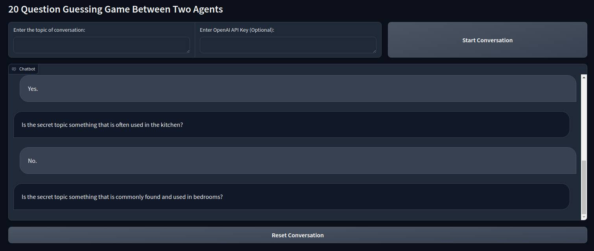
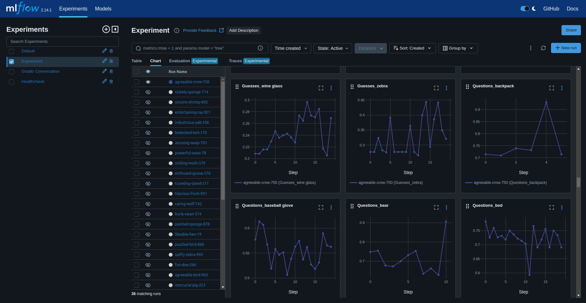

# 20 Questions
Let’s get agents to play the game of 20 questions!

## Overview
I approached this task starting with a literature review and competitive analysis. The outcome of these lead me to decide on a single agent for the “host” and a multi(3)-agent “crew” for the “guesser” utilising CrewAI to rapidly prototype.
## Gradio UI
To view the game in real-time, I used Gradio UI to create a chat UI.
 
## MLFlow Threaded Experiment Tracking
To run multiple experiments at once, I used concurrent futures to multi-thread runs with MLFlow for experiment tracking. 

## Tests
I took the time to write a few small tests for key pieces of the project e.g. to check agents had memory of the conversation, however in a normal project of mine they would be far more extensive.
## Recording Guesses
This initially posed a challenge, raising questions of when and where guesses should be recorded. I decided that I would record a guess each round to be able to track the guesser’s performance over time. Through the use of a CrewAI task with a callback, automating this process ended up being relatively straightforward
## Recording “GAME OVER”
By its definition, the game ends when the guesser correctly guesses the topic of the game. Registering this “GAME OVER” state proved slightly more challenging than anticipated, for instance the host would accept “domestic cat” if the topic was “cat” and the string “cat” /= “domestic cat” but “cat” in “domestic cat”. Equally “cat” in “bobcat” but the host would not accept that answer. In the end I combined a variety of fuzzy conditions to register when the game was won, however this approach could be improved by adding a callback to the host or guesser to register “GAME OVER”.

# Key Challenges
## Bugs in the CrewAI Package
In order to quickly prototype a multi-agent system for the “guesser”, I used CrewAI as a foundation.I was drawn to its really nice Crew-Task structure and the ability to easily define agents with prompts, however unfortunately the package comes with large bugs which make some features mostly unusable (this is well documented on Stack Overflow).

In particular, I wanted to implement a hierarchical (vertical) structure for my crew with a manager agent as literature suggests these crews tend to be more performant. However runs failed for unexpected reasons so much with that structure that I have had to implement a horizontal structure.

In addition, another bug with the package is that it cannot print to console if you initialise more than one crew, making debugging with multiple concurrent experiments tricky. and even with a single crew sometimes the console would stop updating (whilst the gradio UI continued). 

I believe there is a clear opportunity to develop a more robust package, and with more time I would love to build one from scratch.

# Future Work
## Vertical Team Structure

Research by Guo et al. has shown that a vertical team structure (e.g. a lead or “manager”) agent improves team performance. They found that without a leader, most teams spend ~50% of their time giving orders to eachother, and that with a leader they can achieve 10% faster task completion. Interestingly they also highlight that teams with rotating leadership provide the best results. Given the bugs in the CrewAI package, I was unable to implement a vertical team structure, however I would love to explore this with more time.

Building a Multi-Agent Python Package from Scratch
In the interest of time, I utilised CrewAI to build a multi-agent team, however given all the challenges, bugs and limitations of that package, it opens up the opportunity to build a new package.

## Exploring Different Multi-Agent Architectures
There are a few different multi-agent architectures I would be interested to explore, in particular:
### DyLAN
One of the limitations of the present approach is that prior to runtime, I have manually assigned Tasks to agents, and during runtime agents must perform all tasks each round, in this case tasks comprise of:
Making a guess given the conversation history and hitting a callback
Planning, writing and delivering the next yes-or-no question
At the start, it may not be wise for agents to make guesses, as often they are biased by the examples given in their preamble.

DyLAN counteracts this static approach by allowing the right agent for the task to be chosen at inference time each round, and in particular they propose an agent team optimisation algorithm based on an unsupervised metric termed Agent Importance Score, enabling the
selection of best agents based on the contribution each agent makes. This would be an interesting avenue for exploration!

### AgentVerse

In a similar vein to DyLAN, AgentVerse also enables a more dynamic team structure, with the recruitment stage allowing agents to be added or removed in order to best complete a task. In this paper, they found that horizontal teams were better suited for collaborative tasks whereas vertical teams were better suited for situations where there is a separation of concerns. It would be interesting to explore a dynamic approach where the team structure can vary each round and for each task.

### MetaGPT

This paper highlights that often conversation between agents can be a limiting factor when it comes to the speed and quality of task completion as superfluous conversations can take the agents off-topic. In MetaGPT, they implement a Publish-Subscribe mechanism for information sharing (sort of like Kafka) where all agents publish their information in a structured format in a central location, and other agents can “subscribe” to retrieve information relevant to their tasks and goals. It would be interesting to explore to what degree structured information sharing vs pub/sub impacts performance 
